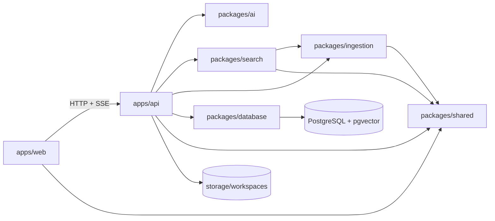

# KnowledgeOS AI Context

Canonical navigation hub for coding assistants. Read only the context file for the subtree you need, then open the listed key files.

## Purpose

KnowledgeOS is a local-first archive system that converts source documents to Markdown, extracts structured knowledge, indexes it in PostgreSQL/pgvector, and produces citation-grounded answers.

## Responsibilities

- Define repository-wide architecture, ownership, navigation, and invariants.
- Route work to the smallest relevant application or package subtree.
- Keep AI assistants from scanning unrelated source files.

## Out of Scope

- Feature specifications; use `PROJECT.md` and topical files under `docs/`.
- Module internals; follow the nearest subtree `AI_CONTEXT.md`.
- Generated workflow output; its canonical source is `packages/shared/src/chat-workflow.ts`.

## Architecture



Primary data flow:

```text
source file -> Markdown -> normalize/chunk/extract -> database + embeddings
question -> analyze/plan -> entity + lexical + semantic retrieval -> rerank
         -> evidence safety -> grounded generation -> validation -> persistence/SSE
```

## Dependencies

- Workspace manager: pnpm 9; TypeScript project references are package-local.
- Runtime applications: Fastify API and Next.js web UI.
- Persistence: Drizzle ORM, PostgreSQL, pgvector, and workspace-local files.
- AI providers: adapters in `packages/ai`; runtime selection in `apps/api`.

Dependency direction:

```text
apps -> packages
packages/search -> packages/ingestion + packages/shared
packages/ingestion -> packages/shared
packages/ai, packages/database, packages/shared -> no internal packages
```

## Public APIs

- HTTP/SSE surface: `apps/api/src/routes/`.
- Shared contracts: `packages/shared/src/index.ts`.
- Package exports: each `packages/*/src/index.ts`.
- User interface routes: `apps/web/app/`.

## Entry Points

- API: `apps/api/src/index.ts`.
- Web: `apps/web/app/layout.tsx`, `apps/web/app/page.tsx`, and `apps/web/app/[section]/page.tsx`.
- Database migration: `packages/database/src/migrate.ts`.
- Repository commands: root `package.json`.

## Key Files

1. `PROJECT.md` — project invariants and canonical workflows.
2. `apps/api/AI_CONTEXT.md` — backend request, retrieval, ingestion, and persistence map.
3. `apps/web/AI_CONTEXT.md` — UI composition and API integration map.
4. `packages/AI_CONTEXT.md` — reusable package ownership and dependency rules.
5. `docs/AI_CONTEXT.md` — topical documentation index.
6. `package.json` and `pnpm-workspace.yaml` — commands and workspace boundaries.

## Common Tasks

| Task | Read next | First source files |
| --- | --- | --- |
| Query analysis or planning | `apps/api/src/services/AI_CONTEXT.md` | `query-analyzer.ts`, `execution-planner.ts` |
| Retrieval or reranking | `apps/api/src/services/AI_CONTEXT.md` | `semantic-search.ts`, `search.ts`, `rag-core.ts`, `hybrid-router.ts` |
| Chat answer flow | `apps/api/src/services/AI_CONTEXT.md` | `chat.ts`, `evidence-preparer.ts`, `evidence-safety.ts` |
| Upload/indexing | `apps/api/src/services/AI_CONTEXT.md`, `packages/ingestion/AI_CONTEXT.md` | `documents.ts`, `entities.ts`, package pipeline files |
| API endpoint | `apps/api/src/routes/AI_CONTEXT.md` | matching route, then matching service |
| Frontend panel | `apps/web/app/AI_CONTEXT.md` | matching `*-panel.tsx`, contexts, shell |
| UI primitive | `apps/web/components/AI_CONTEXT.md` | matching component under `components/ui` |
| Database schema/migration | `packages/database/AI_CONTEXT.md` | `schema.ts`, newest migrations |
| Provider adapter/prompt | `packages/ai/AI_CONTEXT.md` | `providers/*`, `prompts.ts` |
| Shared API/UI contract | `packages/shared/AI_CONTEXT.md` | `index.ts`, `chat-workflow.ts` |
| Tests | `apps/api/test/AI_CONTEXT.md` | matching unit/integration/RAG test |

## Important Constraints

- Preserve original files as evidence; indexed working content is Markdown.
- Scope all data and filesystem operations to a workspace.
- Never deliver an ungrounded chat answer; citation and evidence validation precede persistence and delivery.
- Database changes require a new migration; never rewrite existing migrations.
- API/UI shared contracts belong in `packages/shared`.
- Chat workflow changes must update `packages/shared/src/chat-workflow.ts` and regenerate docs.
- Prefer local-first operation and the smallest adequate model; protect external-provider boundaries.
- Avoid package-to-app imports and deep imports that bypass package `index.ts` exports.
- Verify with relevant tests and `corepack pnpm typecheck`; use `corepack pnpm verify` for broad changes.

## Dependency Ownership

- Owned here: repository topology, commands, global invariants, and navigation.
- Consumes from: module context files and `PROJECT.md`.
- Provides to: every application, package, script, test, and documentation task.
- Must never depend on: transient build output, `node_modules`, generated storage, or private workspace data.
- Expected extension points: new workspace packages, app modules, and deeper context files when a subtree becomes too large.

## Related Modules

- Backend work -> `apps/api/AI_CONTEXT.md`.
- Frontend work -> `apps/web/AI_CONTEXT.md`.
- Reusable domain code -> `packages/AI_CONTEXT.md`.
- Documentation discovery -> `docs/AI_CONTEXT.md`.
- Build/document generation -> `scripts/AI_CONTEXT.md`.

## Navigation Guide

1. Read this file once.
2. Open exactly one relevant module `AI_CONTEXT.md`.
3. If present, open one deeper subtree context.
4. Inspect the 3–10 key files named there.
5. Expand the search only when the documented dependency edge requires it.

## Design Philosophy

- Local-first, evidence-preserving, workspace-scoped.
- Deterministic checks surround probabilistic model calls.
- Small packages expose stable boundaries; applications own orchestration.
- Documentation narrows context instead of duplicating implementation details.

