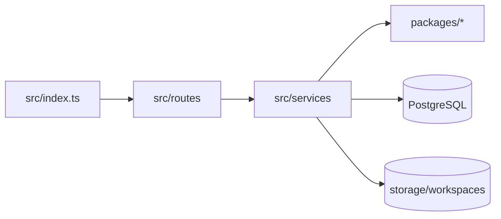

# API Application Context

## Purpose

Fastify backend for workspace management, document conversion/indexing, search, chat/RAG orchestration, settings, and local operations.

## Responsibilities

- Validate HTTP and multipart requests and expose JSON/SSE endpoints.
- Orchestrate package capabilities into workspace-scoped application workflows.
- Own runtime configuration, provider selection, storage access, and telemetry.

## Out of Scope

- Reusable provider implementations (`packages/ai`).
- Generic normalization/chunking (`packages/ingestion`).
- Database schema ownership (`packages/database`).
- UI state and rendering (`apps/web`).

## Architecture

Routes are transport adapters. Services own application orchestration. Reusable, app-independent logic should move to a package only when it has a stable cross-app contract.

## Dependencies

- Internal: all five `@knowledgeos/*` packages.
- External: Fastify, CORS, multipart, Drizzle, dotenv.
- Consumes from: packages and workspace storage.
- Provides to: web UI and local API clients.
- Must never depend on: `apps/web` implementation files.

## Public APIs

- Route registration functions under `src/routes`.
- SSE chat progress and operation-status contracts.
- Service exports used by routes and tests.

## Entry Points

- `src/index.ts` builds Fastify, loads config, registers routes, and starts port 4000.
- `src/config/env.ts` defines and loads runtime configuration.

## Key Files

1. `src/index.ts`
2. `src/config/env.ts`
3. `src/routes/AI_CONTEXT.md`
4. `src/services/AI_CONTEXT.md`
5. `test/AI_CONTEXT.md`

## Common Tasks

- Add endpoint: read `src/routes/AI_CONTEXT.md`, update matching service first.
- Change query planning/retrieval/chat: read `src/services/AI_CONTEXT.md`.
- Change config/provider role: inspect `env.ts`, `services/ai-providers.ts`, settings route/UI.
- Add backend test: read `test/AI_CONTEXT.md`.

## Important Constraints

- Routes must not contain durable business logic.
- Validate request shape and workspace boundary before service calls.
- Close database clients and respect cancellation signals.
- External AI input must be minimized, sanitized, and explicitly configured.
- Chat output must pass evidence/citation checks before delivery.

## Related Modules

- Transport -> `src/routes/AI_CONTEXT.md`.
- Domain orchestration -> `src/services/AI_CONTEXT.md`.
- Tests -> `test/AI_CONTEXT.md`.
- Shared contracts -> `../../packages/shared/AI_CONTEXT.md`.
- Persistence -> `../../packages/database/AI_CONTEXT.md`.

