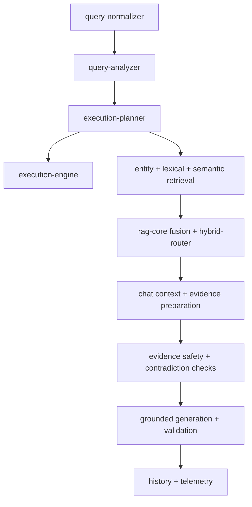

# API Services Context

## Purpose

Application orchestration layer for ingestion, retrieval, chat/RAG, workspaces, providers, and operations.

## Responsibilities

- Combine reusable packages with database/storage access.
- Enforce workspace scope, deterministic safeguards, and fallbacks.
- Own query execution plans, retrieval fusion/reranking, evidence preparation, and grounded generation.
- Persist documents, metadata, entities, chat history, and telemetry.

## Out of Scope

- HTTP request/response formatting (`../routes`).
- Generic provider adapters (`packages/ai`).
- Database schema declarations/migrations (`packages/database`).
- React UI.

## Architecture

Service clusters:

| Cluster | Primary files |
| --- | --- |
| Query planning | `query-normalizer.ts`, `query-analyzer.ts`, `execution-planner.ts`, `execution-engine.ts`, `date-search.ts` |
| Retrieval | `search.ts`, `semantic-search.ts`, `hybrid-search.ts`, `rag-core.ts`, `hybrid-router.ts`, `rag-cache.ts` |
| Chat/evidence | `chat.ts`, `conversation-memory.ts`, `evidence-preparer.ts`, `evidence-safety.ts`, `contradiction-detector.ts` |
| Ingestion/knowledge | `documents.ts`, `entities.ts`, `ingestion-quality.ts`, `ocr-correction.ts`, `workspace-fields.ts` |
| Providers/models | `ai-providers.ts`, `api-escalation.ts`, `model-capabilities.ts`, `small-model-metrics.ts` |
| Workspace/storage | `workspaces.ts`, `storage.ts`, `workspace-*.ts`, `workspace-transfer.ts` |
| Operations | `operations.ts`, `gpu.ts`, `hardware-profile.ts`, `execution-telemetry.ts`, `dashboard.ts` |

## Dependencies

- Internal packages: database, ingestion, search, AI, shared.
- External: Drizzle for typed queries and Node filesystem/crypto primitives.
- Provides to: API routes and backend tests.
- Must never depend on: React, Next.js, or route response objects.
- Forbidden imports: deep package internals bypassing `@knowledgeos/*` exports.

## Public APIs

- Query: `analyzeQuery`, `prepareQueryExecution`, `executeDirectPlan`.
- Search: entity, lexical, semantic, and hybrid search functions.
- Chat: chat preparation/generation and validation helpers.
- Documents/entities: upload, index, extract, link, and persistence functions.
- Workspaces/settings: configuration, prompts, transfer, and field catalog functions.

## Entry Points

- Matching route imports a domain service.
- `chat.ts` is the RAG orchestration entry.
- `documents.ts` and `entities.ts` drive indexing/knowledge persistence.
- `ai-providers.ts` resolves runtime provider roles.

## Key Files

1. The smallest cluster file named in the table above.
2. Its direct imports in this directory.
3. The package context for any `@knowledgeos/*` dependency.
4. Matching tests under `../../test`.
5. `chat.ts` only for changes affecting end-to-end answer flow.

## Common Tasks

- Add query parser/filter: `query-analyzer.ts`, then planner and date/metadata helpers.
- Change planner operation: `execution-planner.ts`, `execution-engine.ts`, telemetry, tests.
- Extend retrieval: matching retriever, `rag-core.ts`, `chat.ts`, RAG tests.
- Modify reranker: `hybrid-router.ts`, `rag-core.ts`, `chat.ts`, model settings.
- Fix metadata extraction: `workspace-fields.ts`, `entities.ts`, ingestion package, tests.
- Add embedding provider role: `ai-providers.ts`, model capabilities, config/settings, AI package.

## Important Constraints

- Keep deterministic identity/date/number rules stronger than model guesses.
- Preserve original query and locked rule/catalog filters during recovery.
- Apply the same workspace/document scope to every active retriever.
- Sanitize evidence before any external provider call.
- Bound candidate counts, text lengths, token budgets, limits, and neighbor distance.
- No answer leaves `chat.ts` before grounding validation succeeds.
- New durable database state requires a migration owned by `packages/database`.
- Large files are orchestration hotspots: extract only cohesive, behavior-preserving units with tests.

## Related Modules

- Transport -> `../routes/AI_CONTEXT.md`.
- Providers -> `../../../../packages/ai/AI_CONTEXT.md`.
- Schema -> `../../../../packages/database/AI_CONTEXT.md`.
- Text pipeline -> `../../../../packages/ingestion/AI_CONTEXT.md`.
- Query classification -> `../../../../packages/search/AI_CONTEXT.md`.
- Workflow contracts -> `../../../../packages/shared/AI_CONTEXT.md`.

