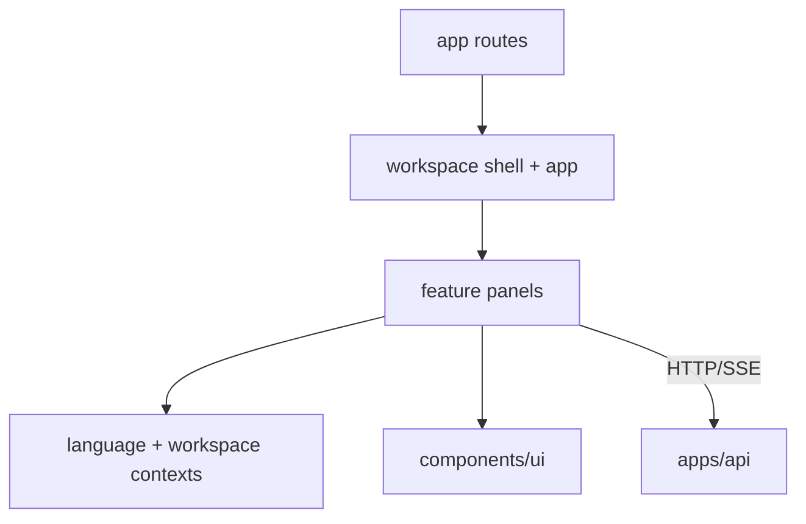

# Web Application Context

## Purpose

Next.js interface for dashboard, documents, conversion, upload, search, entities, chat, settings, transfer, and the live architecture map.

## Responsibilities

- Render workspace-scoped workflows and API state.
- Consume backend JSON, operation progress, and chat SSE events.
- Own navigation, localization, panel composition, and reusable UI primitives.

## Out of Scope

- Retrieval, ingestion, SQL, provider calls, and evidence validation.
- Canonical API business contracts that should live in `packages/shared`.

## Architecture

## Dependencies

- Internal: `@knowledgeos/shared`.
- External: Next.js, React, PrimeReact/PrimeIcons, React Flow.
- Provides to: browser users.
- Must never depend on: API service implementation or database package.
- Forbidden imports: files under `apps/api/src` and deep package internals.

## Public APIs

- Next.js pages under `app/`.
- Workspace contexts/hooks used by panels.
- UI primitives exported from `components/ui/index.ts`.

## Entry Points

- `app/layout.tsx`, `app/page.tsx`, `app/[section]/page.tsx`.
- `app/workspace-app.tsx` and `app/workspace-shell.tsx` compose the interface.

## Key Files

1. `app/AI_CONTEXT.md`
2. `components/AI_CONTEXT.md`
3. `app/workspace-app.tsx`
4. `app/workspace-shell.tsx`
5. `app/workspace-context.tsx`
6. `app/globals.css`

## Common Tasks

- Modify feature screen: read `app/AI_CONTEXT.md` and matching panel.
- Add shared control: read `components/AI_CONTEXT.md`.
- Change API contract: update API/shared contract first, then caller.
- Change architecture view: update `app/architecture-map.tsx` with backend behavior.

## Important Constraints

- Keep workspace identity on every scoped API request.
- Display only progress events actually received; skipped stages stay inactive.
- Keep Turkish/English labels aligned through language context.
- Avoid duplicating server business rules in the client.
- Preserve accessibility labels and responsive behavior.

## Related Modules

- Feature composition -> `app/AI_CONTEXT.md`.
- UI primitives -> `components/AI_CONTEXT.md`.
- API routes -> `../api/src/routes/AI_CONTEXT.md`.
- Shared workflow types -> `../../packages/shared/AI_CONTEXT.md`.

