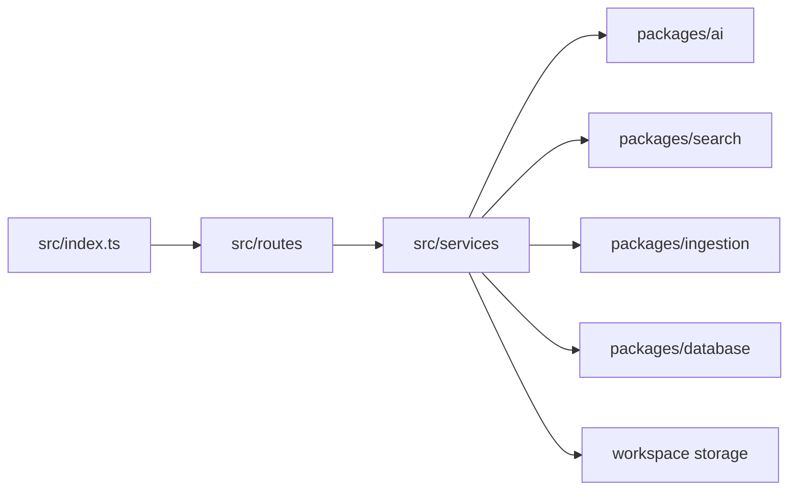

# Backend Architecture

## Purpose

Describe `apps/api` boundaries.

`src/index.ts` registers health, settings, dashboard, workspace, document, conversion, entity, search, and chat routes. Services coordinate cancellation, provider selection, persistence, retrieval, and evidence rules. Reusable algorithms stay in packages.

Related: [request-lifecycle.md](request-lifecycle.md), [planner-pipeline.md](planner-pipeline.md).
