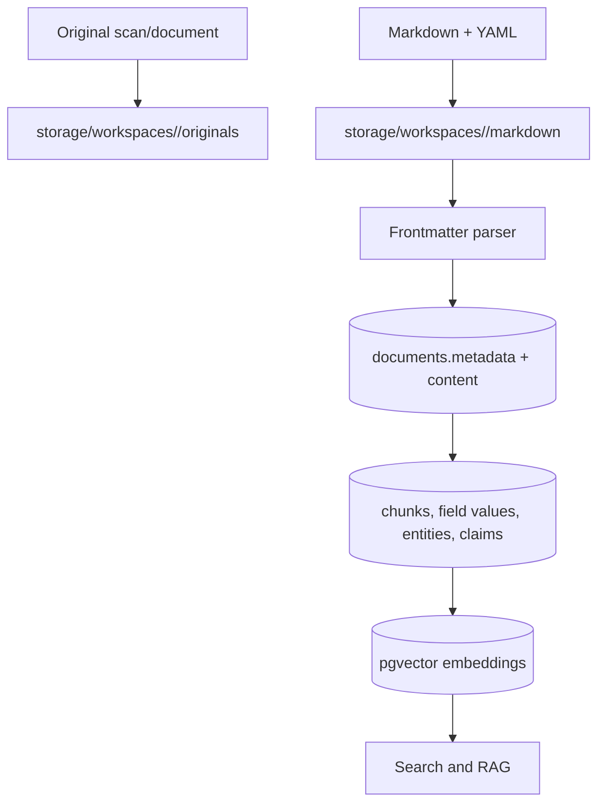

# Data Flow

## Purpose

Show authoritative locations for source, working, and derived data.

Workspace files preserve portable source material. PostgreSQL contains derived query state. YAML scalar/list shape is preserved by the frontmatter parser and stored in `documents.metadata` as JSONB.

Related: [database-schema.md](database-schema.md), [indexing-pipeline.md](indexing-pipeline.md).
