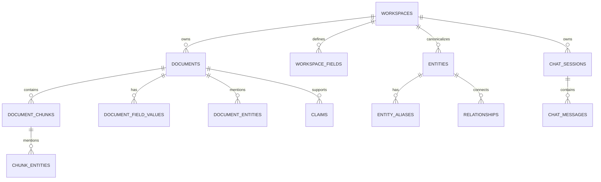

# Database Schema

## Purpose

Summarize persisted workspace knowledge; `packages/database/src/schema.ts` is authoritative.

Every relevant record is workspace-scoped. `documents.metadata` is JSONB for parsed frontmatter; indexed/filterable fields also receive normalized rows. Schema changes require forward-only migrations.

Related: [data-flow.md](data-flow.md), [`../packages/database/AI_CONTEXT.md`](../packages/database/AI_CONTEXT.md).
