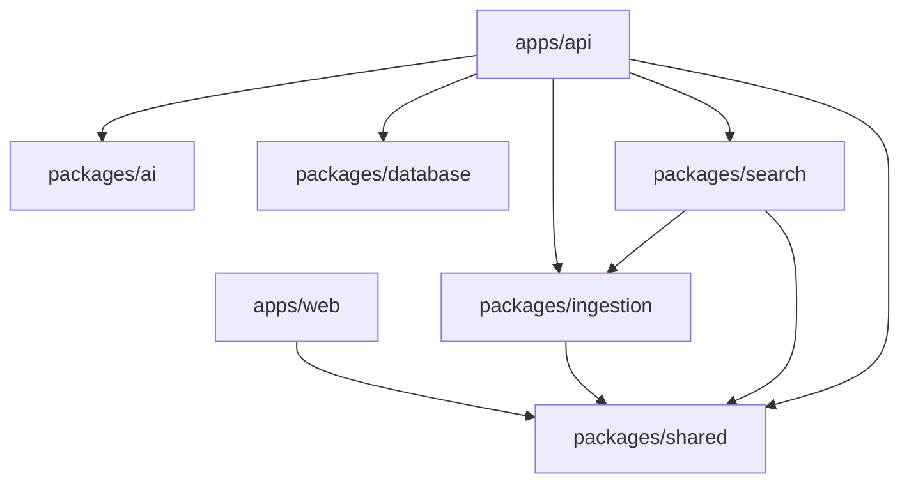

# Module Dependency Graph

## Purpose

Show allowed internal dependency direction.

`packages/ai`, `packages/database`, and `packages/shared` have no internal-package dependencies. `packages/search` consumes ingestion and shared contracts. Do not create app-to-app or package-to-app imports.

Related: [backend-architecture.md](backend-architecture.md), [frontend-architecture.md](frontend-architecture.md).
