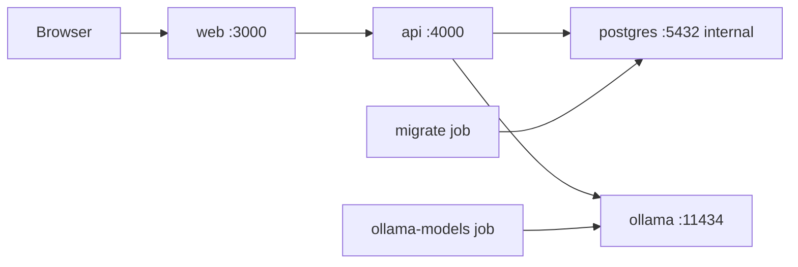

# Deployment Overview

## Purpose

Describe the supported local Docker topology.

`compose.yaml` starts PostgreSQL/pgvector, runs migrations, prepares configured Ollama models, then starts API and web containers. Persistent volumes retain PostgreSQL and Ollama state; workspace and converted Markdown mounts preserve local archive data.

Related: [external-integrations.md](external-integrations.md), [system-overview.md](system-overview.md).
