# Execution Pipeline

## Purpose

Describe conversion through searchable document creation.

```mermaid
flowchart LR
  Source[Original file] --> Convert[Convert to Markdown]
  Convert --> YAML[Optional LLM YAML metadata]
  YAML --> Registry[Registry validation + candidate resolution]
  Registry --> Upload[Upload Markdown]
  Upload --> Parse[Parse frontmatter + normalize]
  Parse --> Chunk[Chunk and deterministic extraction]
  Chunk --> Enrich[Optional LLM enrichment]
  Enrich --> Embed[Generate embeddings]
  Embed --> Persist[(Database + workspace metadata)]
```

Conversion files are staged under `converted-markdown`; registry validation enforces scalar/list contracts before YAML is written. Indexing creates the document, chunks, fields, entities, relationships, claims, and vectors as applicable. The browser’s interactive map is maintained in `apps/web/app/architecture-map.tsx`.

Related: [indexing-pipeline.md](indexing-pipeline.md), [data-flow.md](data-flow.md).
