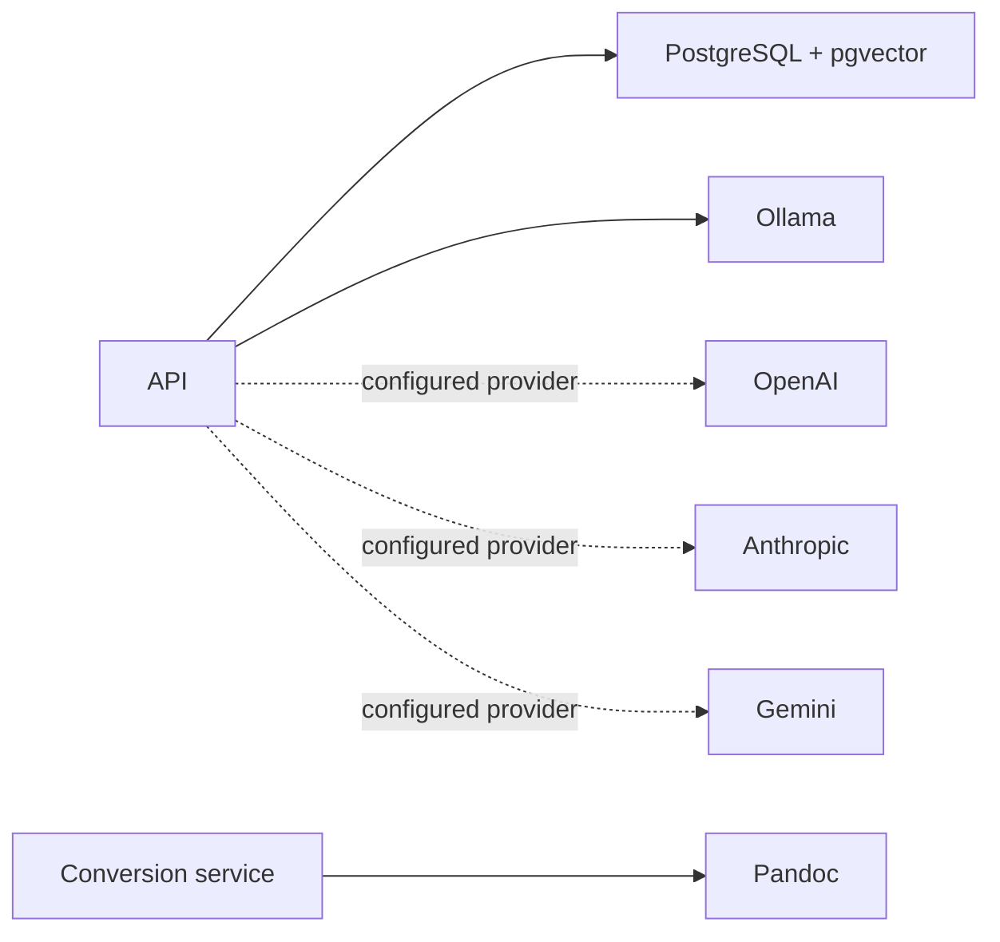

# External Integrations

## Purpose

List runtime boundaries outside repository code.

Provider selection and credentials are configuration-driven. Local Ollama is the default Docker integration; remote providers are optional. External OCR/Markdown preparation is outside the runtime ingestion pipeline.

Related: [deployment.md](deployment.md), [execution-pipeline.md](execution-pipeline.md).
