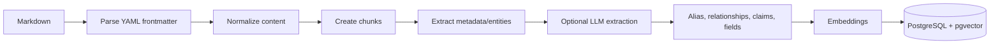

# Indexing Pipeline

## Purpose

Describe Markdown ingestion and derived search data.

Ingestion owns parsing, normalization, and chunking; API services orchestrate workspace-specific persistence and optional enrichment. Preserve original evidence and avoid mutations that erase source wording.

Related: [execution-pipeline.md](execution-pipeline.md), [database-schema.md](database-schema.md).
