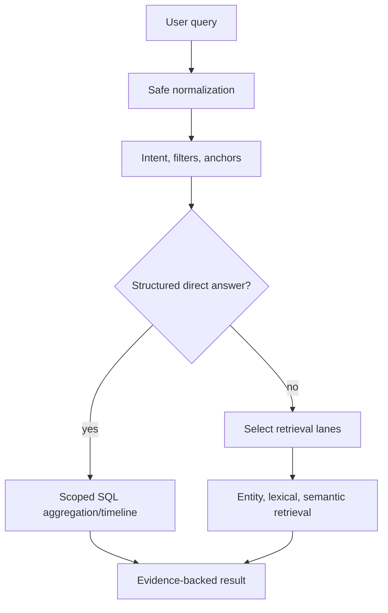

# Planner Pipeline

## Purpose

Describe query-analysis decisions that choose execution rather than answer content.

Planning is rule-based orchestration with explicit capability and cost choices. It must not bypass workspace scope, evidence requirements, or downstream citation validation.

Related: [retrieval-pipeline.md](retrieval-pipeline.md), [rag-pipeline.md](rag-pipeline.md).
