# RAG Pipeline

## Purpose

Describe grounded chat generation.

```mermaid
flowchart LR
  Question --> History[Read/summarize history]
  History --> Retrieve[Plan and retrieve]
  Retrieve --> Context[Budget context + neighboring chunks]
  Context --> Quotes[Select verbatim evidence]
  Quotes --> Safety[Sanitize evidence]
  Safety --> Conflict[Check conflicts]
  Conflict --> Generate[Generate answer]
  Generate --> Validate[Citation and groundedness validation]
  Validate --> Persist[Persist answer + telemetry]
  Persist --> SSE[SSE/UI result]
```

The canonical stage vocabulary is `packages/shared/src/chat-workflow.ts`; regenerate `docs/chat-workflow.mmd` when that file changes. No answer reaches persistence or the UI until validation succeeds.

Related: [retrieval-pipeline.md](retrieval-pipeline.md), [request-lifecycle.md](request-lifecycle.md).
