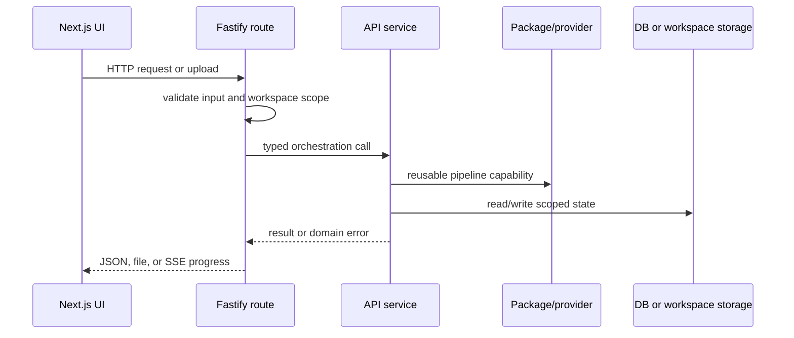

# Request Lifecycle

## Purpose

Describe an API request from browser action to response.

Routes are transport adapters; durable domain behavior belongs in services. Chat operations additionally stream progress events and only persist validated output.

Related: [backend-architecture.md](backend-architecture.md), [rag-pipeline.md](rag-pipeline.md).
