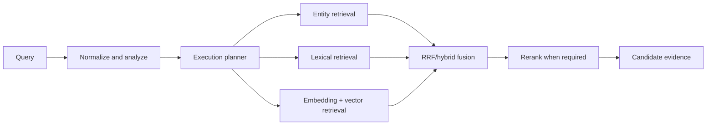

# Retrieval Pipeline

## Purpose

Describe query retrieval before response generation.

The planner may select direct database answers for structured questions. Retrieval remains workspace-scoped and returns evidence candidates, not unsupported conclusions.

Related: [planner-pipeline.md](planner-pipeline.md), [rag-pipeline.md](rag-pipeline.md).
