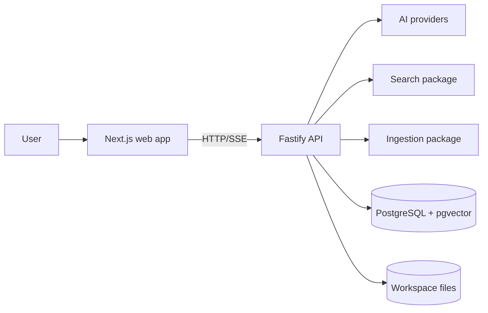

# System Overview

## Purpose

Describe the local-first KnowledgeOS runtime and its primary ownership boundaries.

The web app owns presentation. The API owns workspace-scoped orchestration. Packages provide reusable AI, ingestion, search, shared-contract, and database capabilities. Original documents and Markdown working copies remain in workspace storage; searchable state is persisted in PostgreSQL.

Related: [folder-structure.md](folder-structure.md), [backend-architecture.md](backend-architecture.md), [deployment.md](deployment.md).
