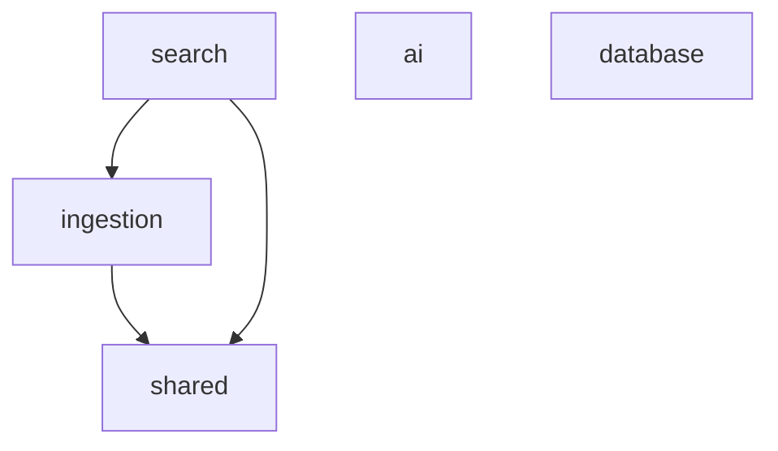

# Workspace Packages Context

## Purpose

Reusable, application-independent building blocks shared by API and web applications.

## Responsibilities

- Expose stable package APIs through each `src/index.ts`.
- Keep provider, persistence, text-processing, search classification, and shared contracts separated.
- Enforce one-way dependency flow.

## Out of Scope

- HTTP routes, React panels, workspace orchestration, and app-specific configuration.
- Cross-package deep imports.

## Architecture

## Dependencies

- `shared`, `ai`, and `database` have no internal workspace dependencies.
- `ingestion` consumes `shared`.
- `search` consumes `ingestion` and `shared`.
- Provides to: applications through `@knowledgeos/*` imports.
- Must never depend on: any `apps/*` module.

## Public APIs

- Package root exports declared by `package.json` and `src/index.ts`.

## Entry Points

- `ai/src/index.ts`, `database/src/index.ts`, `ingestion/src/index.ts`, `search/src/index.ts`, `shared/src/index.ts`.

## Key Files

1. Context file of the package being changed.
2. Its `src/index.ts` public barrel.
3. Its `package.json` dependencies.
4. Direct consumer imports under `apps/api` or `apps/web`.

## Common Tasks

- Add provider -> `ai/AI_CONTEXT.md`.
- Change schema/migration -> `database/AI_CONTEXT.md`.
- Change normalize/chunk/frontmatter -> `ingestion/AI_CONTEXT.md`.
- Change query classification -> `search/AI_CONTEXT.md`.
- Change API/UI type or workflow -> `shared/AI_CONTEXT.md`.

## Important Constraints

- Packages remain app-independent and side-effect-light at import time.
- Export supported APIs through `src/index.ts`; avoid consumer deep imports.
- Do not create circular workspace dependencies.
- Keep types next to their owning behavior unless they are truly cross-app contracts.

## Related Modules

- Backend consumer -> `../apps/api/AI_CONTEXT.md`.
- Web consumer -> `../apps/web/AI_CONTEXT.md`.
- Repository map -> `../AI_CONTEXT.md`.

